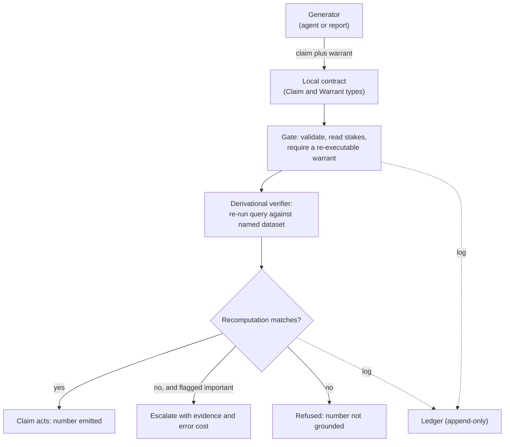
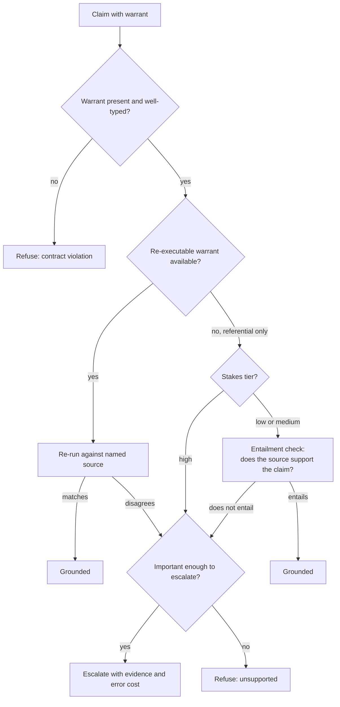
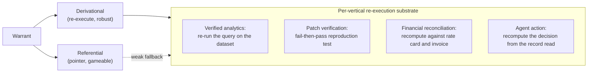
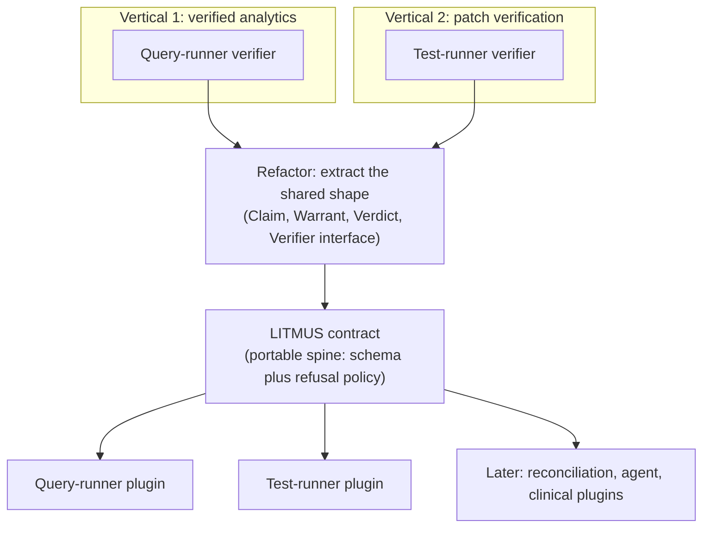
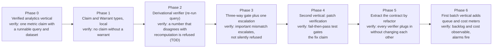

# LITMUS Architecture (revised)

LITMUS is a fail-closed grounding layer: a gate that lets a generated claim act only when the claim carries a warrant the gate can re-check against the domain's source of truth, and refuses by default otherwise.

This revision applies one decision above the others. Do not build the protocol first. The value lives in the verticals, so this document builds one verified vertical end to end, then a second, and treats the shared contract as the thing extracted from that work rather than designed ahead of it. Everything below is shaped by that order, and the corrections that were a separate critique in the prior draft are now constraints the build obeys.

---

## 1. Synthesis

The four briefs collapse to one shape: a power to uncover hidden structure that outruns the institutions meant to absorb it, a discovery-versus-absorption asymmetry. That single cross-domain shape is the unifying point, and it is what licenses a general spine. The ground each domain is checked against, the code path, the dataset, the assay, the record, is singular to that domain and substitutable by nothing else, which is what forces the checker to be a domain-specific organ rather than part of the spine. One shape across domains, one irreducible ground per domain. The system's job is to close the verification half of the asymmetry.

Two stances carry over from the corrected reading. Success is per-domain backlog stability, not a generation-to-verification ratio of one, because a ratio of one is the edge of instability rather than a healthy target. And grounding has two modes: a referential warrant, a pointer to evidence, which is cheap and gameable, and a derivational warrant, a proof or re-execution the gate can re-run, which is expensive and robust because a re-execution cannot be faked the way a pointer can.

## 2. Objective

Reduce the rate at which action-coupled systems commit to fluent, plausible, unsupported claims, by requiring every acting claim to carry a warrant the gate can re-check, preferring re-execution to citation, routing the ungrounded-but-important set to a human with the evidence and the cost of being wrong in hand, and holding each domain's unverified queue stable. The objective is met when the following hold.

1. No claim acts without a typed, well-formed warrant.
2. Referential warrants pass only when the source entails the assertion, not merely when the pointer resolves, with the entailment-false rate below a per-domain threshold.
3. High-stakes claims carry a derivational warrant wherever the domain admits a re-execution.
4. Each domain's unverified backlog is stable, meaning utilization below one with margin, not merely small on average.
5. Verification cost per claim stays below generation cost per claim.
6. The escalation path is exercised, each escalated decision logged against a named error-cost estimate and an owner.

## 3. Design principles

These are the prior corrections, stated as rules the architecture follows rather than as a list of regrets.

First, prefer derivational warrants, and require them for high-stakes claims wherever a re-execution exists, because a re-execution is not gameable. Second, if a referential warrant is used, its entailment check must be cheaper and narrower than generation, a quoted span plus a small constrained checker, or the gate is relocating risk rather than removing it; the cleanest way to honor this in the first build is to seed on a domain whose ground truth is a re-execution, so the seed avoids a model judging a model entirely. Third, refuse by default but calibrate the verdict into grounded, escalated, or refused, with a per-domain escalation path and named error costs, and treat a high-stakes claim carrying only a referential warrant as an escalation, never a pass, except under the single condition principle 3 in `principles.md` states for a domain that has no derivational substrate at all. Fourth, auditability is not trust; the ledger is evidence for a reviewer, not reassurance for a user, and the system does not claim the demand-side trust problem. Fifth, synchronous before asynchronous; build the per-claim path first and turn on the backlog monitor and cost meter only when a batch domain arrives. Sixth, cost is a guardrail, not telemetry; if verification stops being cheaper than generation, the gate is becoming a tax that only the well-resourced can pay. Seventh, protocol-last; the contract is extracted from two working verticals, not authored before either runs.

## 4. Choosing the seed vertical

A good seed has a re-executable source of truth, needs no expert in the loop for the core verdict, runs synchronously per claim, resists gaming, is buildable now, and has a genuinely different second vertical waiting so the eventual extraction is real rather than cosmetic.

Against those criteria, clinical appeal, the earlier pick, is weaker than it looks. Medical necessity and coverage criteria are judgment-laden, so the ground truth is interpreted rather than re-executed, the core verdict needs a clinician, and the warrant leans referential. That is the harder, recursion-prone path, not the clean starting one. The principle in section 3, prefer re-execution and avoid a model judging a model, argues for a different seed.

Four candidates, evaluated.

Verified analytics, a metric claim grounded by re-running its query against the named dataset, is the simplest vertical that still demonstrates derivational grounding. The ground truth is a deterministic recomputation, no sandbox is needed, no expert is needed, and the failure mode it kills, hallucinated numbers, is everywhere.

Patch verification, a fix or vulnerability claim grounded by a reproduction test that fails before the change and passes after, run against the named code path, is the strongest demonstration and the most adversarially robust, since a passing test cannot be faked. It needs a sandbox, so it is slightly more plumbing, and it maps directly to the brief that started this.

Financial reconciliation, a deduction or audit claim grounded by recomputing against the rate card, the invoice, and the delivery proof, carries the highest commercial leverage for you, since it is the ground your own venture already stands on. It adds upstream document extraction as a separate error source and is batch rather than per-claim.

Agent action, a step grounded by recomputing the decision from the record the agent read, is broad and topical but needs a constrained instance before the ground truth is crisp.

The recommendation is to seed with verified analytics, because it is the fastest route to a working fail-closed vertical with a re-executable ground truth and no expert in the loop. Take patch verification as the second vertical, because it re-executes against a genuinely different substrate, a test runner rather than a query engine, which is what makes a contract extracted from the pair real rather than cosmetic, and because it brings the security narrative and the sandbox you will want regardless. Hold financial reconciliation and clinical work as later verticals. The first is your strongest commercial fit once the contract exists, the second is where the referential mode and the human escalation path get exercised in earnest.

## 5. The seed, concretely

In verified analytics a claim is a stated quantitative assertion a generator wants to emit, for example a metric over a scope equals a value. Its warrant is derivational: the executable query that recomputes the value against the named dataset. The verifier re-runs the query in a read-only context and compares the result to the asserted value within tolerance. Fail-closed means no number reaches the user or the report unless the recomputation matches. A number with no runnable query, or one whose recomputation disagrees, is refused, or escalated if it is flagged important. The warrant is not a pointer to a row that mentions the figure; it is the query that produces the figure, re-run, which is why the mode is derivational and not referential.



The seed has no queue monitor and no cost meter. Those arrive with the first batch vertical, per section 8.

## 6. The contract, concretely

These types are local to the seed. They become the LITMUS contract only after a second vertical is shown to share the same shape.

```typescript
// Local to the seed vertical. Promoted to the LITMUS contract
// only once a second vertical shares this shape.

type Warrant =
  | { mode: "derivational"; recipe: ReExecutable; expected: Value; result: ReExecutionResult }
  | { mode: "referential"; pointer: EvidenceRef; entailment: EntailmentResult };

interface Claim {
  id: string;
  assertion: string;     // the proposition or action proposed
  scope: ScopeRef;       // what the assertion is over
  stakes: StakesTier;    // high stakes require the derivational mode
  warrant: Warrant;      // non-optional: no claim without a warrant
}

interface Verifier {
  // a query runner here; a test runner in the second vertical
  verify(w: Warrant): { holds: boolean; observed: Value };
}

type Verdict =
  | { status: "grounded"; warrant: Warrant }
  | { status: "escalated"; reason: string; errorCost: ErrorCostEstimate; owner: ReviewerId }
  | { status: "refused"; reason: string };
```

## 7. Decision logic

The gate tries re-execution first, sends a high-stakes claim that can only offer a referential warrant straight to escalation unless the domain admits no re-execution and the vertical meets the three conditions of principle 3's exception, and uses the entailment check only for low and medium stakes. The flowchart below shows the default path.



## 8. The two warrant modes across verticals

Each vertical instantiates the same two modes against its own substrate. The derivational column is the one to prefer, and it differs in kind from vertical to vertical, which is the domain singularity made concrete.



## 9. How the protocol emerges

The contract is an outcome of building two verticals, not a starting artifact. After the analytics vertical and the patch vertical both run, refactor out the shape they share, and only then does LITMUS exist as a portable spine with the two verifiers behind it as plugins.



If the two verifiers turn out not to share a shape, that is the signal the abstraction was premature, and the right move is to keep them separate and revisit. The contract earns existence at the refactor or not at all.

## 10. What turns on later

When the first batch vertical arrives, financial reconciliation auditing a flood of deductions, or mass code scanning, two services switch on. The queue monitor tracks the unverified backlog per domain and holds utilization below one with margin, since a backlog that grows without limit is the failure the whole project is about. The cost meter holds verification per claim below generation per claim, and crossing it is a design failure rather than a metric to note. Until a batch vertical exists, both are interfaces, not running services, because the synchronous seed does not need them.

## 11. Steps to initiate building

Each step pairs an action with a verification check, so the work can loop without constant clarification.



1. Build the verified-analytics vertical against a real dataset you control. Verify: one concrete metric claim is specified together with the runnable query and the dataset it reads.
2. Define Claim and Warrant types local to this vertical, derivational mode first. Verify: the type system rejects a claim constructed without a warrant.
3. Write the failing test first, where a stated number that disagrees with the recomputation is refused, then implement the query-runner verifier until it passes. Verify: red to green, and a number that matches its recomputation passes.
4. Wire the three-way gate and one escalation path carrying the evidence and an error-cost field. Verify: a flagged-important mismatch escalates rather than passing or refusing in silence.
5. Build the second vertical, patch verification, with a reproduction test that must fail before the change and pass after, run against the named path. Verify: a fix claim is refused unless the fail-then-pass transition holds.
6. Extract the shared shape into the LITMUS contract by refactoring the verticals behind it. Verify: every verifier plugs in without being modified to fit. If they will not, keep them separate and revisit.
7. When the first batch vertical arrives, add the queue monitor and cost meter. Verify: per-claim verification cost and backlog are observable, and the alarms fire on seeded cases.

The object is still not a universal verifier. It is two fail-closed verticals whose shared shape becomes a contract, a gate that prefers re-execution to citation, and a set of verifiers that do not generalize. Seeding on verified analytics rather than clinical appeal is the same principle applied to the first move: start where the ground truth is a cheap re-execution and no expert is in the loop, so the first thing built demonstrates grounding without leaning on a model to judge a model.
